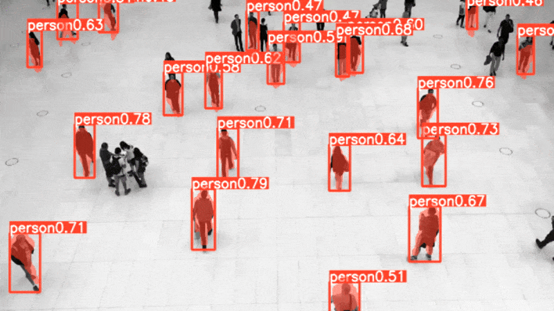

# Advantech-YOLO-Vision-Applications Container
**Version:** 2.0
**Release Date:** November 2025
**Copyright:** © 2025 Advantech Corporation. All rights reserved.
A professional toolkit for deploying optimized YOLOv8 vision applications container on Advantech edge AI devices with hardware acceleration.

>  Check our [Troubleshooting Wiki](https://github.com/Advantech-EdgeSync-Containers/GPU-Passthrough-on-NVIDIA-Jetson/wiki/Advantech-Containers'-Troubleshooting-Guide) for common issues and solutions.

## Overview

This repository provides a streamlined solution for running YOLOv8 computer vision applications  container on Advantech edge AI hardware. The Container includes toolkit  which automatically detects your device capabilities and sets up an optimized environment for computer vision tasks with full hardware acceleration support.

Designed specifically for Advantech edge AI devices based on NVIDIA Jetson platforms, this toolkit enables rapid deployment of object detection, instance segmentation, and classification applications with minimal configuration required.

## Host System Requirements

| Component | Version/Requirement |
|-----------|---------|
| **JetPack** | 5.x |
| **CUDA** | 11.4.315 |
| **cuDNN** | 8.6.0.166 |
| **TensorRT** | 8.5.2.2 |
| **OpenCV** | 4.5.4 |

* CUDA , CuDNN , TensorRT , OpenCV versions Depends on JetPack version 5.x
* Please refer to the [NVIDIA JetPack Documentation](https://developer.nvidia.com/embedded/jetpack) for more details on compatible versions.

## Container Description
## Hardware Specifications

| Component | Specification |
|-----------|---------------|
| Target Hardware | NVIDIA Jetson™ |
| GPU | NVIDIA® Ampere architecture with 1024 CUDA® cores |
| DLA Cores* | 1 (Deep Learning Accelerator) |
| Memory | 4/8/16 GB shared GPU/CPU memory |
| JetPack Version | 5.x |

*Depends on the Hardware Specification please check the host configuration for mroe details.
## Software Components

The following software components are available in the base image:

| Component | Version | Description |
|-----------|---------|-------------|
| CUDA® | 11.4.315 | GPU computing platform |
| cuDNN | 8.6.0 | Deep Neural Network library |
| TensorRT™ | 8.5.2.2 | Inference optimizer and runtime |
| PyTorch | 2.0.0+nv23.02 | Deep learning framework |
| TensorFlow | 2.12.0 | Machine learning framework |
| ONNX Runtime | 1.16.0 | Cross-platform inference engine |
| OpenCV | 4.5.0 | Computer vision library with CUDA® |
| GStreamer | 1.16.2 | Multimedia framework |

## Features

- **Complete Docker Environment**: Pre-configured container with all necessary hardware acceleration settings
- **Optimized Model Management**: Tools for downloading and converting YOLOv8 models to accelerated formats
- **Hardware Acceleration Support**: Full integration with NVIDIA CUDA, TensorRT, and GStreamer
- **X11 Display Support**: Seamless visualization of model outputs directly from the container
- **Multiple Vision Applications**: Ready-to-use applications for object detection, segmentation, and classification

## Applications Included

### Object Detection
- Real-time object detection using YOLOv8
- Support for 80+ COCO dataset classes
- Configurable confidence thresholds and post-processing


### Instance Segmentation
- Pixel-level object segmentation for precise boundary detection
- Multi-class segmentation capabilities
- Visualization tools for segmentation masks

### Object Classification
- High-accuracy image classification
- Support for custom classification tasks
- Class confidence visualization

## Before You Start
Please take a note of the following points:

- Ensure the following components are installed on your host system:
  - **Docker** (v28.1.1 or compatible)
  - **Docker Compose** (v2.39.1 or compatible)
  - **NVIDIA Container Toolkit** (v1.11.0 or compatible)
  - **NVIDIA Runtime** configured in Docker


## Quick Start

1. Clone this repository:
```bash
git clone https://github.com/Advantech-EdgeSync-Containers/Advantech-YOLO-Vision-Applications.git
cd Advantech-YOLO-Vision-Applications
# Provide executable rights
# Make sure the directory has init.sh , build.sh and wise-bench.sh
chmod +x *.sh
```

2. Start the container environment:
```bash
./build.sh
```

3. Install required dependencies inside the Container:
```bash
# Install Ultralytics YOLOv8 framework with specific versions
pip install ultralytics==8.0.43 --no-deps
pip install ultralytics-thop==2.0.14 --no-deps
```

4.   AI Accelerator and Software Stack Verification (Optional)
```
# Verify AI Accelerator and Software Stack Inside Docker Container
# Under /advantech, run this command

# To run Wise-bench
./wise-bench.sh
```

3. The Docker container will launch with all necessary hardware acceleration. You can access the applications as described in the Usage sections below.


4. Please refer to the [Acknowledgments](#acknowledgments) section for required package versions and installation commands before proceeding.


### Model Loading Utility

The `advantech-coe-model-load.py` utility helps download optimized YOLOv8 models for your Advantech device:

```bash
python3 src/advantech-coe-model-load.py 
```

Parameters:
- `task`: Choose from 'detection', 'segmentation', or 'classification' (default: detection)
- `size`: Model size, use 'n' for nano or 's' for small (default: based on device)
- `dir`: Directory to save models (default: current directory)

Examples:
```bash
# Download a YOLOv8n detection model
python3 src/advantech-coe-model-load.py --task detection --size n

# Download a YOLOv8s segmentation model
python3 src/advantech-coe-model-load.py --task segmentation --size n
```

### Model Export Utility

The `advantech-coe-model-export.py` utility provides an interactive interface to convert YOLOv8 models to optimized formats for edge deployment on Advantech devices:
#### Running the Export Utility
```bash
python3 src/advantech-coe-model-export.py
```

#### System Verification

The utility automatically detects and verifies your hardware and software environment:

**Detected Device Information:**
- Device Model (e.g., NVIDIA Jetson Orin NX)
- GPU Architecture (e.g., Ampere)
- Compute Capability
- GPU Memory
- JetPack Version

**Software Dependencies Status:**
- ultralytics
- torch (with CUDA support)
- onnx
- onnxruntime
- tensorrt

**System Libraries with Path:**
- cuda
- cudnn
- tensorrt_libs
- onnx_runtime_libs

#### Interactive Export Workflow

**Step 1: Select YOLOv8 Task**

Available tasks with input sizes:
- **[1] Object Detection**
- **[2] Instance Segmentation** - Input: 640x640
- **[3] Classification** - Input: 224x224

**Step 2: Select Model Size**

Available model sizes for your selected task:
- **[1] Nano (YOLOv8n)** - Fastest inference, best for real-time on Jetson
- **[2] Small (YOLOv8s)** - Good balance for edge devices
- **[3] Medium (YOLOv8m)** - Higher accuracy, moderate speed
- **[4] Large (YOLOv8l)** - High accuracy, slower inference
- **[5] XLarge (YOLOv8x)** - Maximum accuracy, slowest inference

**Step 3: Select Export Format**

Export format options with device-specific optimization:
- **[1] ONNX format (CPU mode)**
  - Format: ONNX, Device: CPU
  - Half precision (FP16): No, Optimize: Yes
  - Exports to ONNX format using CPU (compatible with all systems)
  - Requires: onnx

- **[2] ONNX format (GPU mode, FP16)**
  - Format: ONNX, Device: GPU
  - Half precision (FP16): Yes, Optimize: No
  - Exports to ONNX format using GPU acceleration with FP16 for Jetson
  - Requires: onnx

- **[3] TensorRT Engine (FP16) (RECOMMENDED)**
  - Format: ENGINE, Device: GPU
  - Half precision (FP16): Yes, Optimize: No
  - Exports to TensorRT engine for maximum inference speed on Jetson
  - Requires: tensorrt

- **[4] TorchScript**
  - Format: TORCHSCRIPT, Device: GPU
  - Half precision (FP16): No, Optimize: No
  - Exports to TorchScript format for PyTorch deployment
  - Requires: torch

**Step 4: Select Batch Export Configuration**

The utility supports batch export of multiple models:
- Proceed with batch export of 1 model? (y/n)
- Option to add more tasks and repeat the process


#### Examples

**Export Detection Model to TensorRT (Recommended for Jetson):**
```bash
python3 src/advantech-coe-model-export.py
# Select: [1] Object Detection → [1] Nano → [3] TensorRT Engine (FP16)
```

**Export Segmentation Model to ONNX:**
```bash
python3 src/advantech-coe-model-export.py
# Select: [2] Instance Segmentation → [1] Nano → [2] ONNX format (GPU mode, FP16)
```

**Export Classification Model to TorchScript:**
```bash
python3 src/advantech-coe-model-export.py
# Select: [3] Classification → [2] Small → [4] TorchScript
```


## Application Usage

### YOLOv8 Vision Application

The main `advantech-yolo.py` application offers an interactive pipeline for running YOLOv8 models with an easy-to-use menu system:
```bash
python3 src/advantech-yolo.py
```

#### Interactive Menu Options:

1. **Task Selection**:
   - [1] Detection
   - [2] Classification
   - [3] Segmentation

2. **Format Selection**:
   - [1] PyTorch
   - [2] ONNX
   - [3] TensorRT

3. **Source Selection**:
   - [1] Webcam
   - [2] RTSP
   - [3] File

4. **Camera/Resolution Configuration**:
   - Automatic camera discovery with device listing
   - Resolution selection (e.g., 1920x1080)

5. **Output Options**:
   - Save output: (y/n)
   - Show display: (y/n)

The pipeline will then start processing with real-time feedback including:
- Model loading status
- Warm-up progress
- FPS counter
- Flask app serving for Health Check

Press 'q' in the display window or Ctrl+C to stop the pipeline.

### Results:
 
 #### Object Detection

 #### Instance Segmentation

 #### Classification
 


### Step-by-Step Usage Guide

1. **Set Up Environment**:
   - Start the Docker container using `./build.sh`
   - This initializes all hardware acceleration settings and dependencies

2. **Download Models**:
   - Use `advantech-coe-model-load.py` to download appropriate YOLOv8 models
   - Choose model size based on your device capability ('n' or 's' recommended)

3. **Convert Models (Optional)**:
   - Use `advantech-coe-model-export.py` to convert to optimized formats
   - TensorRT format (engine) provides the best performance on Advantech devices

4. **Run Applications**:
   - Use `advantech-yolo.py` with appropriate parameters for your use case
   - Configure input source, model, and task type as needed
   - Enable visualization with `--show` parameter

5. **Analyze Results**:
   - View real-time results on screen or examine saved outputs
   - Output includes annotations, bounding boxes, segments, or classifications based on task

## Directory Structure

```
Advantech-YOLO-Vision-Applications/
├── data/                           # Sample test data
├── src/                            # Source code for applications
│   ├── advantech-coe-model-export.py  # Model export utility
│   ├── advantech-coe-model-load.py    # Model download utility
│   ├── advantech-yolo.py              # Main interactive YOLO application
│   ├── advantech-core.py              # Core functionality and utilities
│   └── advantech-classes.py           # Class definitions and configurations
├── docker-compose.yml              # Docker Compose configuration
├── build.sh                        # Container build and launch script
├── init.sh                         # Initialization script
├── wise-bench.sh                   # AI accelerator verification script
├── LICENSE                         # License information
└── README.md                       # This file
```

## Performance Recommendations

For optimal performance on Advantech edge AI devices:

| Task | Recommended Model | Optimal Format |
|------|------------------|----------------|
| Object Detection | YOLOv8n/s | TensorRT Engine |
| Instance Segmentation | YOLOv8n-seg/s-seg | TensorRT Engine |
| Classification | YOLOv8n-cls/s-cls | TensorRT Engine |

The toolkit automatically selects appropriate configurations based on your device, with preference for smaller and more efficient models (n and s variants) to ensure real-time performance.

## Limitations

The current version of the toolkit has the following limitations:

1. **Model Size Constraints**: Only supports 'n' and 's' model variants to maintain real-time performance on edge devices. Larger models may exceed memory or computational capabilities of some devices.

2. **Pre-trained Models Only**: Currently limited to pre-trained YOLOv8 models. Custom model training requires external workflows.

3. **Resolution Limits**: Performance degrades with very high-resolution inputs (>1080p). For best results, use input at 640×640 or 1280×720 resolution.

4. **Network Dependency**: Initial model downloading requires internet connectivity.

5. **X11 Display Requirements**: Visualization features require X11 forwarding to be properly configured.

6. **Fixed Detection Classes**: Models use pre-trained COCO classes and cannot be dynamically changed without retraining.

7. **Single Stream Processing**: Currently supports processing one input stream at a time.


## Use Cases

This toolkit is ideal for:

- **Industrial Quality Inspection**: Detect defects and inspect parts with instance segmentation
- **Smart Retail**: Product recognition, customer behavior analysis
- **Smart Cities**: Traffic monitoring, crowd analysis, object tracking
- **Security & Surveillance**: Perimeter monitoring, intrusion detection
- **Agriculture**: Crop monitoring, livestock tracking
- **Healthcare**: Medical image analysis, equipment tracking
- **Robotics**: Environmental perception, object manipulation guidance

## License

Copyright (c) 2025 Advantech Corporation. All rights reserved.

This software is provided by Advantech Corporation "as is" and any express or implied warranties, including, but not limited to, the implied warranties of merchantability and fitness for a particular purpose are disclaimed.

For complete license details, see the [LICENSE](https://github.com/Advantech-EdgeSync-Containers/Advantech-YOLO-Vision-Applications/blob/main/LICENSE) file.

## Acknowledgments

- **[Ultralytics](https://github.com/ultralytics/ultralytics)**: For the YOLOv8 framework that powers this toolkit. 
  ```bash
  # Required specific versions:
  pip install ultralytics==8.0.43 --no-deps
  pip install ultralytics-thop==2.0.14 --no-deps
  ```


- **[NVIDIA](https://developer.nvidia.com/)**: For CUDA, TensorRT, and other acceleration libraries that enable optimal performance on Advantech edge AI devices.


