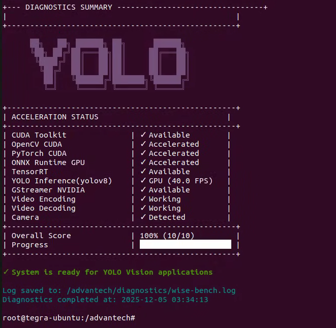
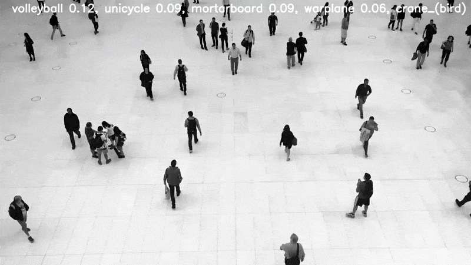
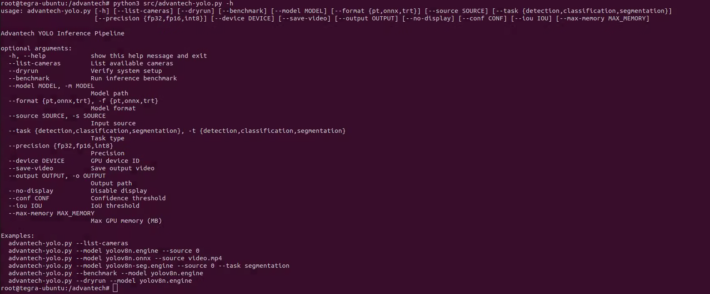

# Advantech YOLO Vision Applications

**Version 2.0.0 | November 2025 | Advantech Corporation**

A containerized toolkit for deploying YOLOv8 computer vision applications on Advantech edge AI devices with hardware acceleration.

---

## Overview

This repository provides a production-ready Docker environment for running YOLOv8 inference on NVIDIA Jetson-based Advantech hardware. The container includes pre-configured software for object detection, instance segmentation, and image classification with full GPU acceleration.

The toolkit automatically detects device capabilities and configures optimal settings for real-time performance.

**Supported Applications:**

| Application | Description |
|:------------|:------------|
| Object Detection | Real-time detection with bounding boxes for 80 COCO classes |
| Instance Segmentation | Pixel-level masks for precise object boundaries |
| Image Classification | Categorization across 1,000 ImageNet classes |

For troubleshooting, see the [Troubleshooting Wiki](https://github.com/Advantech-EdgeSync-Containers/GPU-Passthrough-on-NVIDIA-Jetson/wiki/Advantech-Containers'-Troubleshooting-Guide).

---

## Table of Contents

- [System Requirements](#system-requirements)
- [Quick Start](#quick-start)
- [Model Management](#model-management)
- [Running Inference](#running-inference)
- [Export Formats](#export-formats)
- [Performance Guidelines](#performance-guidelines)
- [Directory Structure](#directory-structure)
- [Limitations](#limitations)
- [License](#license)

---

## System Requirements

### Host System

Install these components on your Advantech device before using this toolkit.

| Component | Version |
|:----------|:--------|
| JetPack | 5.1.2 |
| CUDA | 11.4.315 |
| cuDNN | 8.6.0.166 |
| TensorRT | 8.5.2.2 |
| OpenCV | 4.5.4 |
| Docker | 28.1.1 or later |
| Docker Compose | 2.39.1 or later |
| NVIDIA Container Toolkit | 1.11.0 or later |

Component versions depend on your **JetPack Version**. See [NVIDIA JetPack Documentation](https://developer.nvidia.com/embedded/jetpack) for details.

### Container Environment

The Docker container includes the following pre-configured components.

| Component | Version | Description |
|:----------|:--------|:------------|
| CUDA | 11.4.315 | GPU computing platform |
| cuDNN | 8.6.0 | Deep Neural Network library |
| TensorRT | 8.5.2.2 | Inference optimizer and runtime |
| PyTorch | 2.0.0+nv23.02 | Deep learning framework |
| TensorFlow | 2.12.0 | Machine learning framework |
| ONNX Runtime | 1.16.0 | Cross-platform inference engine |
| OpenCV | 4.5.0 | Computer vision library with CUDA |
| GStreamer | 1.16.2 | Multimedia framework |

### Supported Hardware

| Specification | Details |
|:--------------|:--------|
| Platform | NVIDIA Jetson (Orin, Xavier, TX2) |
| GPU Architecture | Ampere, Volta, Pascal |
| Memory | 4GB, 8GB, or 16GB shared |
| JetPack | 5.x |


## Before You Start
Before proceeding, ensure that your system meets the required [System Requirements](#system-requirements). If you encounter any issues or inconsistencies in your environment, please consult our [Troubleshooting Wiki](https://github.com/Advantech-EdgeSync-Containers/GPU-Passthrough-on-NVIDIA-Jetson/wiki/Advantech-Containers'-Troubleshooting-Guide) for solutions and to verify that all prerequisites are properly satisfied
---

## Quick Start

### Step 1: Clone the Repository

Download the toolkit to your device.

```bash
git clone https://github.com/Advantech-EdgeSync-Containers/Advantech-YOLO-Vision-Applications.git
cd Advantech-YOLO-Vision-Applications
```

### Step 2: Set Permissions

Grant execute permissions to the setup scripts.

```bash
chmod +x *.sh
```

### Step 3: Start the Container

Launch the Docker environment. This script creates project directories, configures GPU access, and opens an interactive terminal inside the container.

```bash
./build.sh
```

### Step 4: Install Dependencies

Inside the container, install the YOLOv8 framework. These specific versions are validated against the container's software stack and are used for yolo inference testing in the wise-bench so make sure you install these first before running the wise-bench.

```bash
pip install ultralytics==8.0.43 --no-deps
pip install ultralytics-thop==2.0.14 --no-deps
```

### Step 5: Verify Installation (Optional)

Run the diagnostic script to confirm hardware acceleration is working.

```bash
./wise-bench.sh
```
The wise-bench script will run as below as per the system specifications.


---

## Model Management

### Downloading Models

The model loader detects your hardware and recommends appropriate models.

```bash
python3 src/advantech-coe-model-load.py
```


The utility presents an interactive menu. Select a model by entering its number.

| Option | Model | Task | Description |
|:-------|:------|:-----|:------------|
| 1 | YOLOv8n | Detection | Recommended for real-time applications |
| 2 | YOLOv8n-seg | Segmentation | Recommended for real-time applications |
| 3 | YOLOv8n-cls | Classification | Recommended for real-time applications |
| 4 | YOLOv8s | Detection | Higher accuracy, moderate speed |
| 5 | YOLOv8s-seg | Segmentation | Higher accuracy, moderate speed |
| 6 | YOLOv8s-cls | Classification | Higher accuracy, moderate speed |

Nano (n) models provide the fastest inference and are recommended for real-time applications. Small (s) models offer higher accuracy at reduced speed.


### Exporting Models

Convert models to optimized formats for deployment.

```bash
python3 src/advantech-coe-model-export.py
```
The export utility guides you through three selections (Task, Size, Format).


**Task Selection:**

| Option | Task | Input Size |
|:-------|:-----|:-----------|
| 1 | Object Detection | 640×640 |
| 2 | Instance Segmentation | 640×640 |
| 3 | Classification | 224×224 |

**Model Size Selection:**

| Option | Size | Characteristics |
|:-------|:-----|:----------------|
| 1 | Nano | Fastest inference, best for real-time |
| 2 | Small | Good balance of speed and accuracy |
| 3 | Medium | Higher accuracy, moderate speed |
| 4 | Large | High accuracy, slower inference |
| 5 | XLarge | Maximum accuracy, slowest inference |

**Format Selection:**

| Option | Format | Recommendation |
|:-------|:-------|:---------------|
| 1 | ONNX (CPU mode) | Development and testing |
| 2 | ONNX (GPU mode, FP16) | When TensorRT unavailable |
| 3 | TensorRT Engine (FP16) | **Recommended for production** |
| 4 | pytorch | Ultralytics native |


---

## Running Inference

### Interactive Mode (User Mode)

Launch the main application with menu-driven configuration.

```bash
python3 src/advantech-yolo.py
```

The application prompts for task type, model format, model path, input source, and output options. Press `q` in the display window or `Ctrl+C` to stop.

---


## Interactive Workflow Results 

### Object Detection


### Instance Segmentation


### Classification



---

### Command Line Mode (Developer Mode)
For more details related to CLI parameters
```bash
python3 src/advantech-yolo.py -h
```



For scripted or automated use, specify options directly.

```bash
python3 src/advantech-yolo.py --model yolov8n.engine --source 0 --task detection
```

```bash
python3 src/advantech-yolo.py --model yolov8n-seg.engine --source /path/to/your/video_file --task segmentation
```

```bash
python3 src/advantech-yolo.py --model yolov8n-cls.onnx --source rtsp://your-camera-ip:port/ --task classification
```

**Available Options:**

| Option | Description | Default |
|:-------|:------------|:--------|
| `--model` | Model file path | Required |
| `--source` | Input source (device number, URL, or file path) | Required |
| `--task` | detection, classification, or segmentation | detection |
| `--format` | pt, onnx, or trt | Auto-detected |
| `--conf` | Confidence threshold | 0.25 |
| `--iou` | IoU threshold for NMS | 0.45 |
| `--save-video` | Save output to file | False |
| `--output` | Output directory | ./output |
| `--no-display` | Disable visualization | False |

---

## Export Formats

Choosing the correct export format significantly affects inference speed.

### TensorRT Engine (Recommended)

TensorRT is NVIDIA's inference optimizer and produces the fastest results on Jetson hardware. It fuses operations, optimizes memory layout, and calibrates precision automatically. FP16 precision reduces memory usage with minimal accuracy loss. Note that engine files are device-specific and not portable between different GPU architectures.

### ONNX (GPU Mode)

ONNX with CUDA execution provides good performance when TensorRT is unavailable. The FP16 variant uses half-precision for improved throughput. This format offers cross-platform compatibility but moderate performance compared to TensorRT.

### ONNX (CPU Mode)

ONNX with CPU execution runs on any system without GPU requirements. This format provides universal compatibility but the slowest performance. It is suitable for development and testing only.

### Pytorch

PyTorch's serialization format maintains ecosystem compatibility as its Ultralytics native and is useful for PyTorch-specific deployment pipelines. Performance is Fast.

**Performance Comparison:**

| Format | Relative Speed | Primary Use Case |
|:-------|:---------------|:-----------------|
| TensorRT FP16 | Fastest | Production deployment |
| ONNX GPU FP16 | Fast | TensorRT unavailable |
| ONNX CPU | Slow | Development and testing |
| Pytorch | Fast | Ultralytics native |

---

## Performance Guidelines

### Recommended Configurations

| Task | Model | Format | Notes |
|:-----|:------|:-------|:------|
| Object Detection | YOLOv8n or YOLOv8s | TensorRT/Onnx | Best real-time performance |
| Instance Segmentation | YOLOv8n-seg or YOLOv8s-seg | TensorRT | Includes mask output |
| Classification | YOLOv8n-cls or YOLOv8s-cls | Pytorch | 224×224 input size |

### Optimization Notes

Use Nano models for applications that require the maximum frame rate. Use Small models when accuracy is prioritized over speed. TensorRT engines must be rebuilt when moving between different Jetson models. Input resolution affects both speed and accuracy; 640×480 is the default for detection and segmentation. FP16 precision is enabled by default for TensorRT exports.


## Directory Structure

```
Advantech-YOLO-Vision-Applications/
├── src/
│   ├── advantech-coe-model-load.py    # Model download utility
│   ├── advantech-coe-model-export.py  # Model export utility
│   ├── advantech-yolo.py              # Main inference application
│   ├── advantech_core.py              # Inference engine implementations
│   └── advantech_classes.py           # Class label definitions
├── data/                               # Sample data and outputs
├── models/                             # Model storage (created at runtime)
├── docker-compose.yml                  # Container configuration
├── build.sh                            # Container launch script
├── init.sh                             # Dependency installer
├── wise-bench.sh                       # Hardware diagnostics
├── LICENSE                             # GPL-3.0 license
└── README.md
```

---

## Limitations

| Limitation | Description |
|:-----------|:------------|
| Model Size | Only Nano and Small variants are optimized for real-time inference on edge devices |
| Pre-trained Only | Custom training requires external tools; import trained models for inference |
| Resolution | Performance degrades above 1080p; use 640×480 or 1280×720 for best results |
| Network | Model download requires internet connectivity; inference runs offline |
| Display | Visualization requires X11 forwarding (run `xhost +local:docker` on host) |
| Classes | Detection uses COCO classes; classification uses ImageNet classes |
| Streams | Single input stream per container instance |

---


## Use Cases

This toolkit is ideal for:

* **Industrial Quality Inspection:** Detect defects and inspect parts with instance segmentation
* **Smart Retail:** Product recognition, customer behavior analysis
* **Smart Cities:** Traffic monitoring, crowd analysis, object tracking
* **Security & Surveillance:** Perimeter monitoring, intrusion detection
* **Agriculture:** Crop monitoring, livestock tracking
* **Healthcare:** Medical image analysis, equipment tracking
* **Robotics:** Environmental perception, object manipulation guidance

---

## License

GNU General Public License v3.0

Copyright © 2025 Advantech Corporation. All rights reserved.
This software is provided by Advantech Corporation "as is" and any express or implied warranties, including, but not limited to, the implied warranties of merchantability and fitness for a particular purpose, are disclaimed.


For complete license details, see [LICENSE](LICENSE) for complete terms.

---

## Acknowledgments

This toolkit builds upon [Ultralytics YOLOv8](https://github.com/ultralytics/ultralytics) for the core detection, segmentation, and classification framework, and [NVIDIA](https://developer.nvidia.com/) for CUDA, TensorRT, and the Jetson platform.

Required framework installation:

```bash
pip install ultralytics==8.0.43 --no-deps
pip install ultralytics-thop==2.0.14 --no-deps
```

---

## Support

For documentation and troubleshooting, visit the [Troubleshooting Wiki](https://github.com/Advantech-EdgeSync-Containers/GPU-Passthrough-on-NVIDIA-Jetson/wiki/Advantech-Containers'-Troubleshooting-Guide).

For issues, submit to [GitHub Issues](https://github.com/Advantech-EdgeSync-Containers/Advantech-YOLO-Vision-Applications/issues).

---

Advantech Corporation — Center of Excellence


